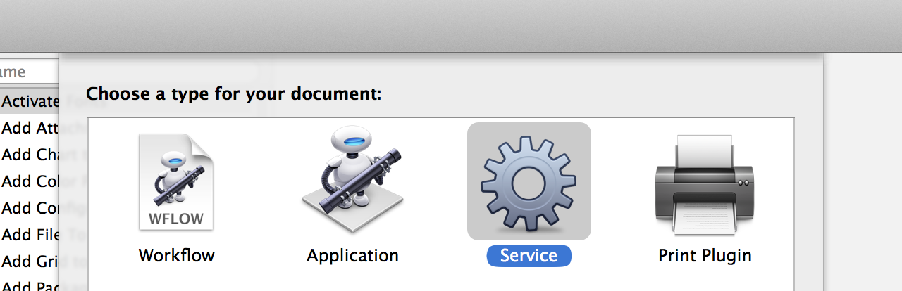
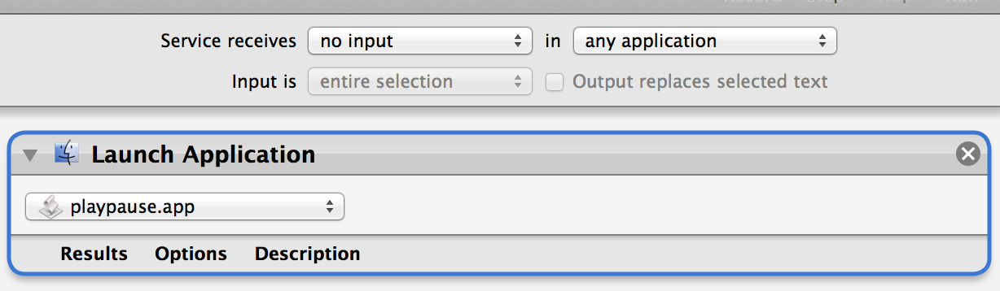
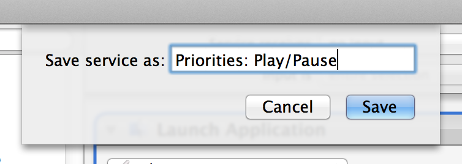
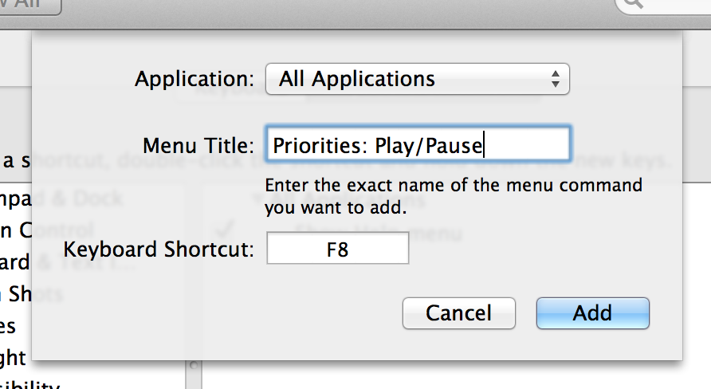

# Priorities

Priorities is a suite of 3 AppleScripts for controlling Mac media apps, giving priority to certain apps when multiple ones are open. By default, it will control the following apps, with the following priority:

1. iTunes
2. Rdio
3. VLC

Included are scripts for Play/Pause, Previous Track and Next Track

**To use these scripts on an Apple-brand keyboard with the function keys, you'll need to disable the standard function key shortcuts for brightness, volume, and the like. If this is a dealbreaker for you, then Priorities isn't for you.**

## Installation

Simply copy the `build` directory of this project to a safe place (preferrably your /Applications directory). If you're feeling extra geeky, you can run the installer script with `./install.sh`, which will copy the build directory to `/Applications/Priorities`.

Now, here's the fun part: you'll need to create a service using Automator that'll launch the Priorities apps. Then, you'll need to setup keyboard shortcuts for those services (and potentially disable the standard media key functionality)

First, open up **Automator.app** and choose to create a service.

Now, you'll need to change the dropdown next to "Service receives" to read **"no input"**. After that, add a single action from the pane on the left side: "Launch Application". Open the application dropdown and scroll down to the very bottom to select **"Other..."**. Navigate to the folder where you put the Priorities apps and select one of them.

In Automator's file menu, choose "Save..." and you'll be asked to input a name for your service. This name is important, as it has to be unique from _any other possible menu item in every other app_, so it's recommended to preface the name with "Priorities: " or something similar. Once you decide on a name, click "Save". You'll need to repeat this service-creation process for each Priorities app (`next`, `previous`, and `playpause`)

Next, open up **System Preferences**. Choose "Keyboard" from that window. If you're using an Apple keyboard (or your laptop's built-in keyboard) and you want to use the media keys (F7, F8, and F9) for Priorities, check the box next to "Use all F1, F2, etc. keys as standard function keys". _Note: this will disable all Apple keyboard shortcuts for volume, brightness, etc._

Select the "Keyboard Shortcuts" tab from the preferences window. In the left pane of the next screen, click on the "Application Shortcuts" item and then the "+" button from below the two panes. In the modal window that appears, fill in the "Menu Title" box with the exact name of the service you just saved. This is important, as one difference in what you type compared to the service name will result in Priorities not working. After that, highlight the "Keyboard Shortcut" box and press the keys you'd like to assign to your chosen Priorities shortcut. You'll need to repeat this keyboard-binding process for each service you created earlier.

Once that's finished, you're off to the races, old sport! Enjoy!

## Contributing

- Fork it
- Create your feature branch (`git checkout -b my-new-feature`)
- Commit your changes (`git commit -am 'Added some feature'`)
- Push to the branch (`git push origin my-new-feature`)
- Create new Pull Request

If you modify the actual scripts (or add a new one), make sure you run `./build.sh`, so the builds get updated. Thanks!
